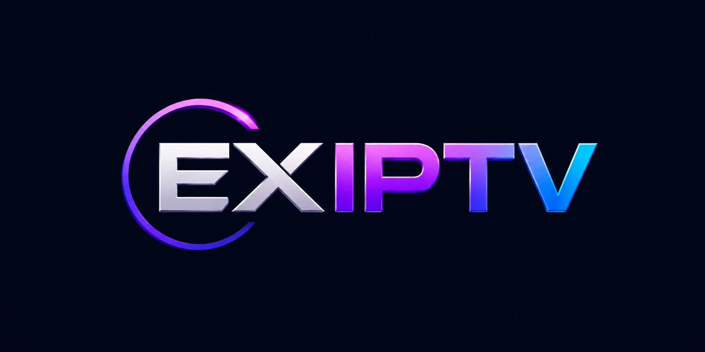

<p align="center">
  
</p>

# EXIPTV

Moderner IPTV-Player für Windows 10/11 (64 Bit). Tauri 2 + Rust-Backend,
React/TypeScript-Frontend, SQLite. Ausschließlich für legal bereitgestellte
Streams und eigene bzw. autorisierte IPTV-Zugänge — ohne Funktionen zur
Umgehung von DRM oder Zugangsbeschränkungen.

## Aktueller Stand (Phase 1–3 Kern)

| Bereich | Status |
|---|---|
| Projektstruktur, Designsystem, Branding | ✅ fertig |
| SQLite-Schema (23 Entitäten), Migrationen | ✅ fertig, getestet |
| Toleranter M3U/Extended-M3U-Parser (Encoding-Erkennung, EXTGRP, EXTVLCOPT, Catch-up-Attribute) | ✅ fertig, getestet |
| Staging-Import (alte Playlist bleibt bei Fehlschlag erhalten) | ✅ fertig, getestet |
| Anbieterverwaltung (UI + Backend), Import-Fortschritt via Events | ✅ fertig |
| Live-TV-Liste (virtualisiert, Gruppen, inkrementelles Laden) | ✅ fertig |
| Suche (normalisiert, entprellt), Einstellungen, i18n DE/EN | ✅ fertig |
| Sichere Zugangsdaten (Windows Credential Manager) | ✅ fertig |
| Logging (rotierend, maskiert), Diagnose-Grunddaten | ✅ fertig |
| Wiedergabe (libmpv), EPG, VOD/Serien, Aufnahmen, Multi-View | 🔜 Phasen 4–9, siehe `docs/PHASENPLAN.md` |

Kern-Testsuite: **28 Tests, alle grün** (`cargo test -p exiptv-core`).

## Voraussetzungen (Entwicklung)

- Windows 10/11 x64 mit [WebView2-Runtime](https://developer.microsoft.com/microsoft-edge/webview2/) (auf aktuellen Systemen vorinstalliert)
- Rust ≥ 1.77 (stable) über rustup
- Node.js ≥ 20
- Für den Installer-Build: keine weiteren Werkzeuge nötig (Tauri bündelt WiX/NSIS selbst)

## Build

```bash
npm install

# Entwicklung (Hot Reload, echtes Rust-Backend)
npx tauri dev

# Nur UI im Browser (mit In-Memory-Mock-Backend)
npm run dev

# Core-Tests (ohne Tauri-Toolchain lauffähig)
cargo test -p exiptv-core

# Produktions-Build inkl. Windows-Installer (MSI + NSIS)
npx tauri build
```

Installer entstehen unter `src-tauri/target/release/bundle/{msi,nsis}/`.
Der NSIS-Installer ist deutsch/englisch, installiert pro Benutzer und bringt
eine saubere Deinstallationsroutine mit.

**CI:** `.github/workflows/windows-build.yml` führt bei jedem Push die
Core-Tests aus und baut anschließend MSI + NSIS auf `windows-latest`
(Artefakt `exiptv-windows-installer`).

## Projektstruktur

```
core/         exiptv-core: Parser, Datenmodell, SQLite, Sicherheit (headless testbar)
src-tauri/    Tauri-Shell: Fenster, IPC-Commands, HTTP, Credential Manager, Logging
src/          React/TypeScript-Frontend (Design-Tokens, Seiten, i18n)
public/       Statische Assets inkl. Branding
docs/         Architektur, Entscheidungen, Phasenplan, Handbücher
```

Weiterführend: `docs/ARCHITEKTUR.md`, `docs/ENTSCHEIDUNGEN.md`,
`docs/PHASENPLAN.md`, `docs/ENTWICKLUNG.md`, `docs/BENUTZERHANDBUCH.md`,
`docs/FEHLERBEHEBUNG.md`, `DATENSCHUTZ.md`.
